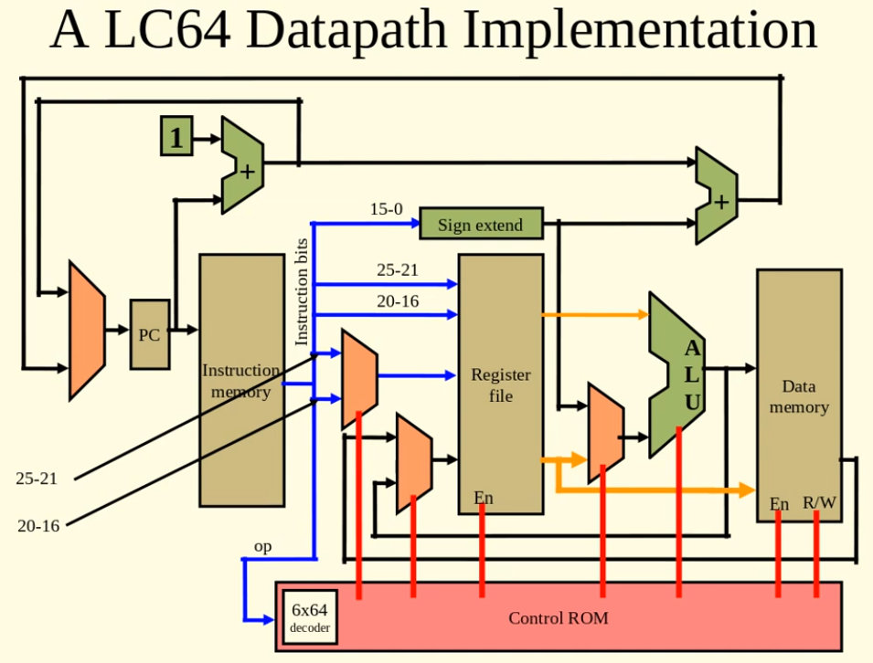
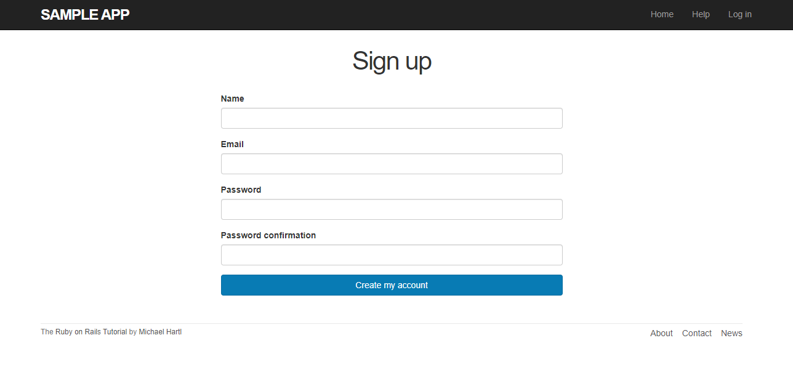

Portfolio
=========

Programming Projects
--------------------

*For access to my private project repositories, please [email me](mailto:example@csustudent.net?subject=GitHub%20Access) with the subject line, GitHub Access.

---
### [Single Cycle Processor Implementation | CSCI 220](/project1)

---
### [Ruby on Rails Sample App | CSCI 434](/project2)

---

Ethics Papers
-------------

### [Software Ownership and Innovation](/pdf/Ethics Paper.pdf)

-   **Class: Applied Networking**  
-   **Grade: A**

### [Importance of Privacy Online](/pdf/Privacy.pdf)

-   **Class: Algorithms** 
-   **Grade: TBA**

### [SoftwareOwnership](/pdf/SoftwareOwnership.pdf)

-   **Class: Operating Systems** 
-   **Grade: TBA**

---

Presentations
-------------

### [Control Rom Design and Implementation](/pdf/Control_ROM.pdf)

- **Class: Computer Archetecture (CSCI 220)** 
- **Grade: A**

---

Page template forked from <a href="https://github.com/csu-cs/csci-portfolio">CSU-CS</a>

<!-- Remove above link if you don't want to attributive -->
