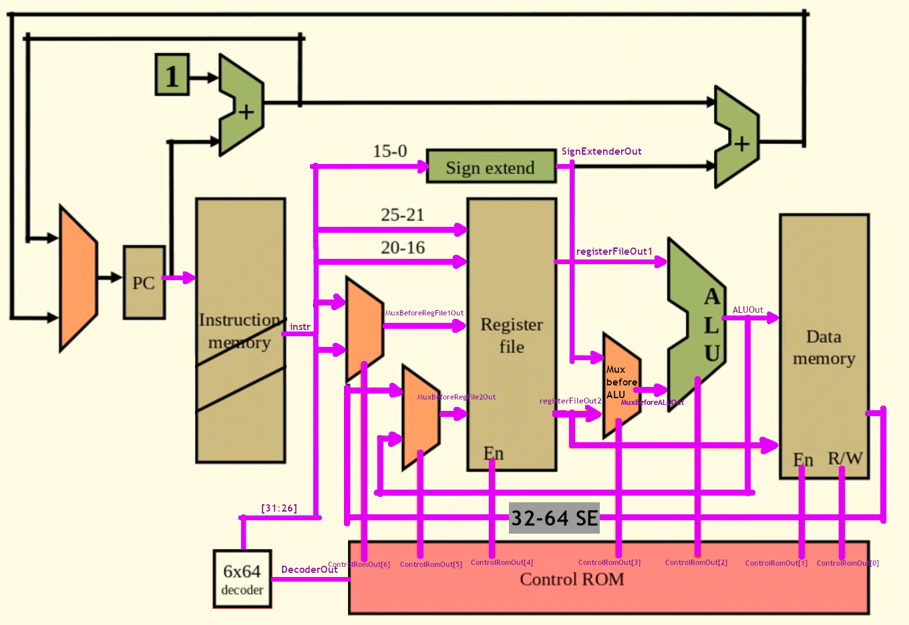

[Back to Portfolio](./)

Single Cycle Processor Implementation
===============

-   **Class:Computer Archetecture (CSCI 220)** 
-   **Grade: B**
-   **Language(s):Verilog, x86 Assembly**
-   **Source Code Repository:** [csci-330-spring-2020](https://github.com/brian2524/csci-330-spring-2020)  
    (Please [email me](mailto:BTHinkle@csustudent.net?subject=GitHub%20Access) to request access.)

## Project description

Written verilog modules that communicate to eachother as a whole. Reads in opcode to perform various tasks (ie. halt and loadWord).

## How to compiles / run the program
```bash
To compile, assemble, and run the simulation:
cd verilog/Single\ Cycle\ Processor/asm
./asm LW.asm LW.mc && cp LW.mc ../ && cd ..
iverilog *.v tests/test-SINGLECYCLEPROCESSORLW.v
make run
```


Fig 1. Single Cycle Processor Diagram


Fig 2. Verilog Representation of Diragram

[Back to Portfolio](./)
