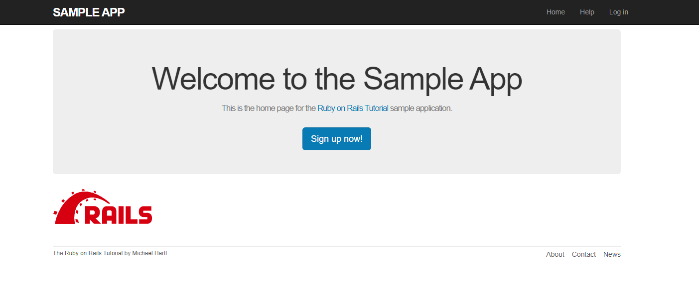
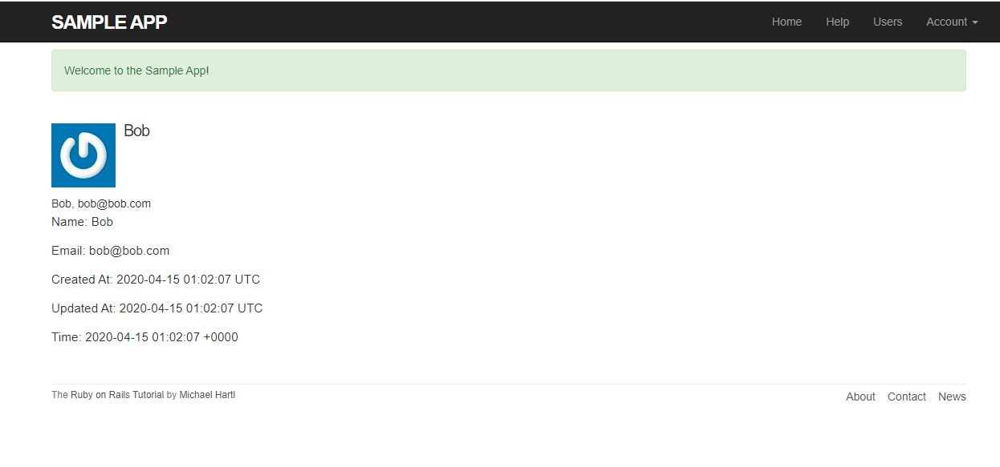
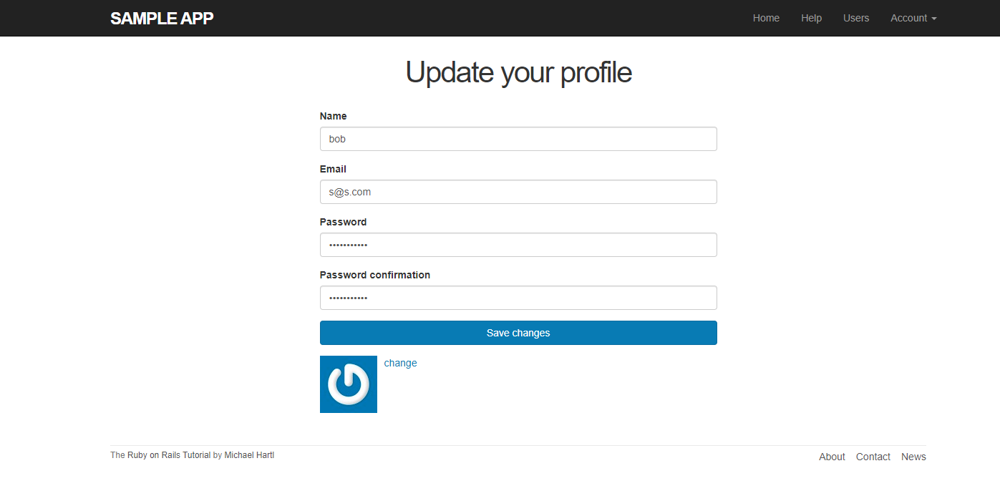
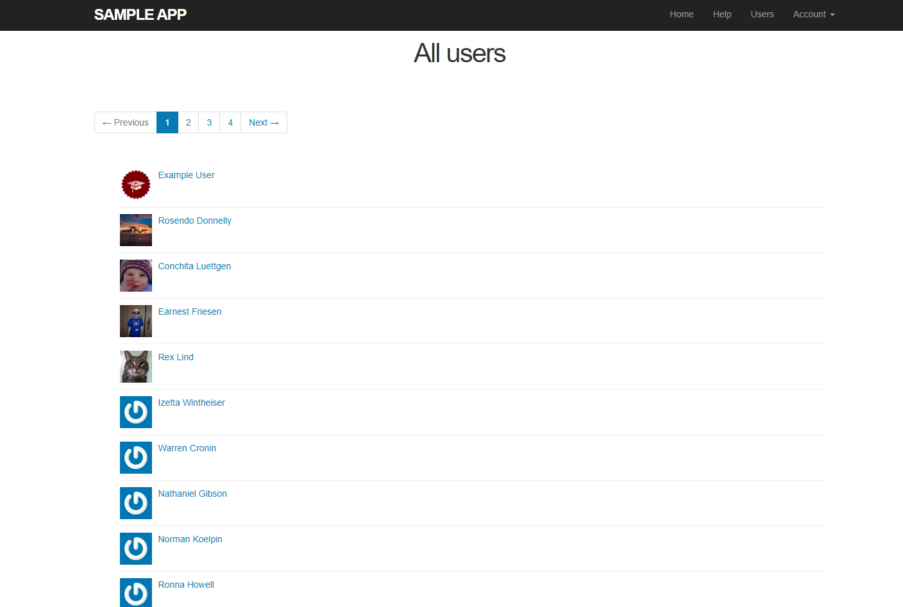

[Back to Portfolio](./)

Ruby on Rails Sample App
===============

-   **Class: Human-Computer Interaction (CSCI 334)** 
-   **Grade: A**
-   **Language(s): Ruby on Rails**
-   **Source Code Repository:** [sample_app](https://github.com/brian2524/sample_app)  
    (Please [email me](mailto:BTHinkle@csustudent.net?subject=GitHub%20Access) to request access.)

## Project description

A sample website I built from my Human-Computer Interaction class using the Ruby On Rails tutorial "THE RUBY ON RAILS TUTORIAL, 6TH ED." by Michael Hartl. It is built using the MVC (Model-View-Controller) architecture with Ruby on Rails. It features a sigup/loggin system that interacts with a database to store users. Users can also update their profile by visiting the "Update your profile" page (Fig 4). Here they can change any information associated with their account as well as set a profile picture. The user can also discover people who are already registered on this website by visiting the "All Users" page (Fig 5).

## How to compile / run the program

To visit, follow this link: https://whispering-beach-83643.herokuapp.com/

Fig 1. The Home screen

Fig 2. Sign up Page

Fig 3. User Profile

Fig 4. Update your profile

Fig 5. All Users page. Displays all profiles in the database.

[Back to Portfolio](./)
