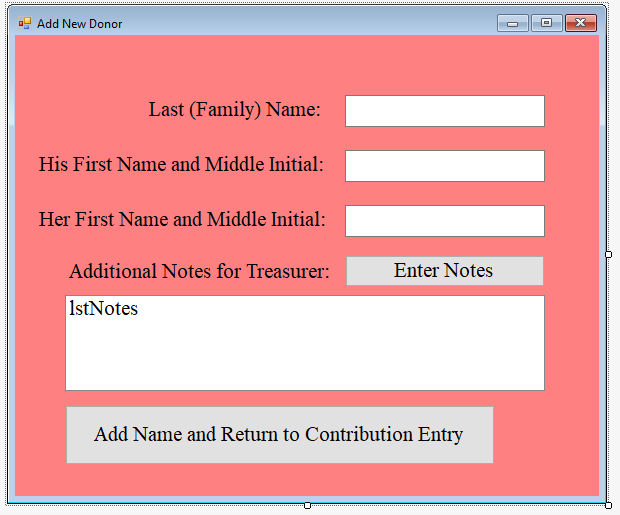

[Back to Portfolio](./)

Donation Tracker
===============

-   **Class:Object Oriented Programming (CSCI 325)** 
-   **Grade: B**
-   **Language(s):Java**
-   **Source Code Repository:** [CSU-CSCI325_FALL2018](https://github.com/brian2524/CSU-CSCI325_FALL2018)  
    (Please [email me](mailto:BTHinkle@csustudent.net?subject=GitHub%20Access) to request access.)

## Project description

A Java application written in Netbeans to store and keep track of Church donors and their donations.

## How to compile / run the program
```In Netbeans click \"Open Project\"
Navigate to \"CSU-CSCI325_FALL2018/DonationProgram/\" and open the project folder
Rightclick on the package icon and click \"clean and build\"
```


Fig 1. Menu screen for registering a new Donor


Fig 2. Menu screen for entering new contributions

[Back to Portfolio](./)
