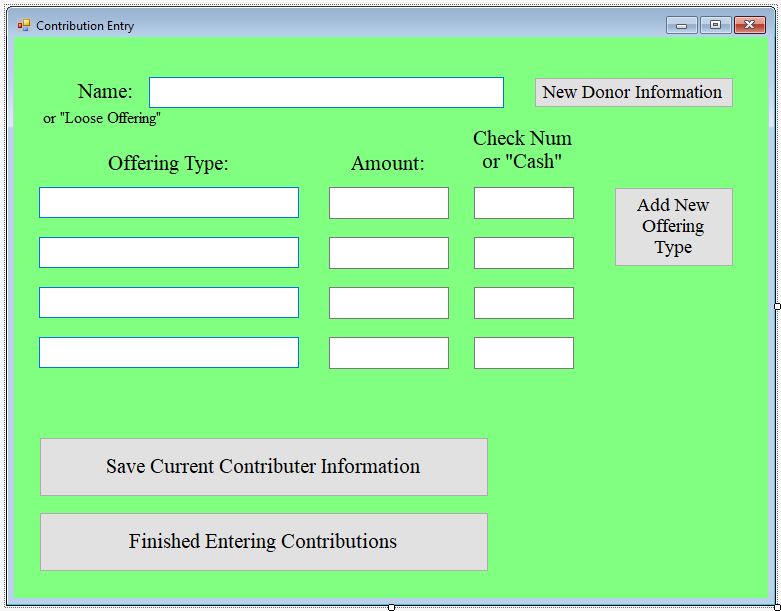

[Back to Portfolio](./)

Donation Tracker
===============

-   **Class: Object Oriented Programming (CSCI 325)** 
-   **Grade: A**
-   **Language(s): Java**
-   **Source Code Repository:** [CSU-CSCI325_FALL2018](https://github.com/brian2524/CSU-CSCI325_FALL2018)  
    (Please [email me](mailto:BTHinkle@csustudent.net?subject=GitHub%20Access) to request access.)

## Project description

A GUI menu-driven Java application made for counting up weekly donations at a Church. It allows entry and retrieval of weekly contributions to a local church. The program should allow the user to print a report listing each donor and the amount and ministry area for the current week and a summary page with total weekly deposit information. The purpose of this program is to allow the counters to communicate efficiently with the treasurer of the church while allowing them to access the current week’s donor information.

## How to compile / run the program
```
Open Netbeans and click "Open Project"
Navigate to "CSU-CSCI325_FALL2018/DonationProgram/" and open the project folder
Right click on the package icon and click "clean and build"
Click the green "play" arrow
```


Fig 1. Main Menu screen


Fig 1. Menu screen for registering a new Donor


Fig 2. Menu screen for entering new contributions for the week

[Back to Portfolio](./)
