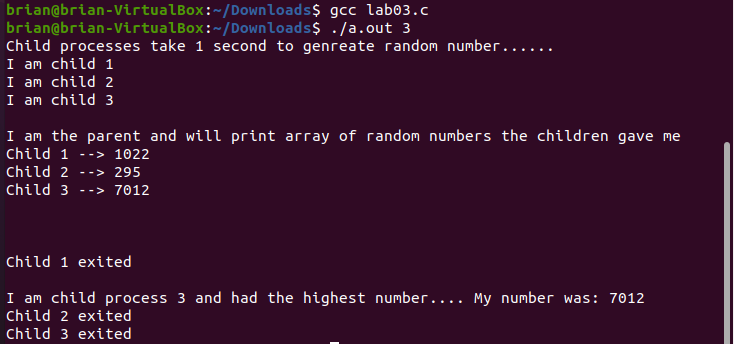

[Back to Portfolio](./)

Processes Lab
===============

-   **Class: Operating Systems (CSCI 431)** 
-   **Grade: TBA**
-   **Language(s): C**
-   **Source Code Repository:** [csci-431-fall-2020](https://github.com/brian2524/CSU-CSCI325_FALL2018)  
    (Please [email me](mailto:BTHinkle@csustudent.net?subject=GitHub%20Access) to request access.)

## Project description

Lab to demonstrate the use of fork() and child processes.

## How to compile / run the program
```
cd csci-431-fall-2020/lab03/src/
gcc lab03.c
./a.out <Input value>
```


Fig 1. Running the program with an input of 3

[Back to Portfolio](./)
